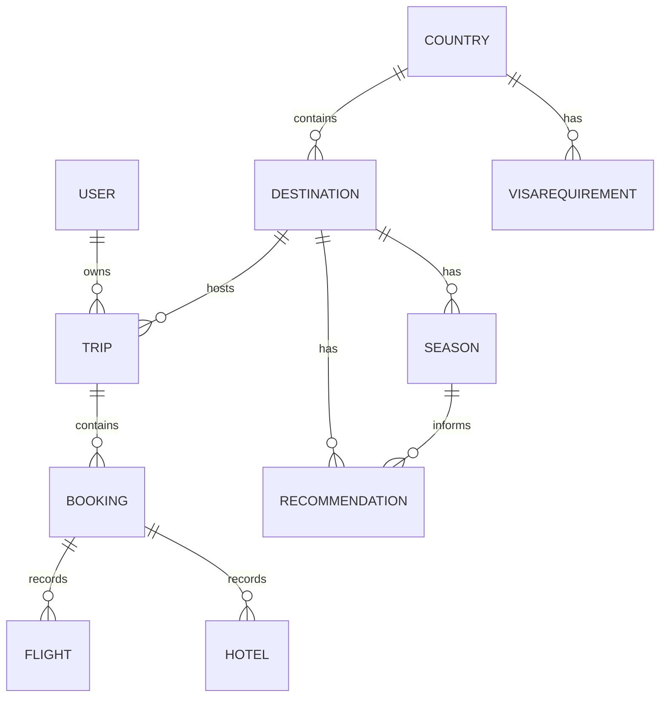

# TravelEase

A Flask and MariaDB university project for organizing trips and recording flight and hotel bookings. Developed for **ISTE 430 — Information Requirements Modeling, RIT Dubai (Group 5)**.

TravelEase connects requirements analysis and relational database design with a working web application. It records booking information entered by the user; it does **not** search live inventory, purchase tickets, process payments, or issue real reservations.

## Features

- Account login with hashed passwords and session management.
- Dashboard listing the signed-in user's trips and booking counts.
- Trip creation with destination, dates, and planning status.
- Flight and hotel booking records with server-side validation.
- Hotel totals calculated from the nightly rate and stay length.
- Printable booking-confirmation reports.
- Destination-based demonstration visa information.
- Trip and booking ownership checks and CSRF protection on POST forms.

## Technology

Python · Flask · MariaDB · PyMySQL · SQL · Jinja2 · HTML · CSS · JavaScript

## Project contribution

Daniyal Zharov led application development and completed the application code, alongside stakeholder interviews, data flow diagrams, decision tables, database modeling, and documentation. The original academic project was submitted by a three-person team as Group 5. This repository contains a cleaned portfolio version of the submitted application.

## Run locally on Windows

Use Python 3.12 or newer and a running MariaDB server. Run the following from the folder containing `app.py`.

### 1. Install dependencies in a virtual environment

```powershell
python -m venv .venv
.\.venv\Scripts\python.exe -m pip install -r requirements.txt
Copy-Item .env.example .env
.\.venv\Scripts\python.exe -c "import secrets; print(secrets.token_hex(32))"
```

Copy the generated value into `SECRET_KEY` in your local `.env`. Set `DB_PASSWORD` to the password of your local application database user. Never commit `.env`.

If `python` is not available but your interpreter is installed at `C:/Python314/python.exe`, use `& C:/Python314/python.exe -m venv .venv` for the first command.

### 2. Create the demo database

In HeidiSQL, connect using a MariaDB administrator account. Open and execute `seed_data.sql`. It creates a **new `TravelEaseDemo` database** and ten tables with fictional user accounts and sample trip records.

The script intentionally does not drop databases. If `TravelEaseDemo` already exists, stop and choose a new database name in the script and `.env`, or explicitly remove only an expendable previous demo database. Your original `TravelEase` database is not migrated or modified.

Create a dedicated application user in HeidiSQL, substituting your own local password:

```sql
CREATE USER 'travelease_app'@'127.0.0.1' IDENTIFIED BY 'choose-your-local-password';
GRANT SELECT, INSERT, UPDATE ON TravelEaseDemo.* TO 'travelease_app'@'127.0.0.1';
```

Put that password in `DB_PASSWORD` in `.env`. Keep the default host `127.0.0.1`, database `TravelEaseDemo`, and user `travelease_app`. If the account already exists, use its existing password and grant access rather than creating it again. Do not change your MariaDB root authentication configuration.

### 3. Set demo account passwords

```powershell
.\.venv\Scripts\python.exe set_demo_passwords.py
```

Choose a password of at least 12 characters when prompted. The script stores a separate salted hash for each demo account. Use it with `alex@example.com`, `jordan@example.com`, or `sam@example.com`. No login password is included in the repository.

### 4. Start the app

```powershell
.\.venv\Scripts\python.exe app.py
```

Open **http://127.0.0.1:5000** and keep the terminal running. Debug mode is off by default and the development server binds only to your own machine.

On macOS/Linux, use `.venv/bin/python` instead of `.\.venv\Scripts\python.exe`; copy the example with `cp .env.example .env`.

## Database model

The supplied implementation has **ten tables**, including `RECOMMENDATION`. Its main booking flow uses eight of them; `SEASON` and `RECOMMENDATION` contain supporting model data without a recommendation interface.



## Repository structure

```text
app.py                    Flask routes, validation, and database access
seed_data.sql             Fresh MariaDB schema and fictional sample records
set_demo_passwords.py     Password-hash setup for demo accounts
.env.example              Configuration template without credentials
requirements.txt          Application dependencies
requirements-dev.txt      Test dependencies
requirements-lock.txt     Exact application versions validated in this build
templates/                Login, dashboard, trip, booking, confirmation pages
static/style.css          Application styling
tests/                    Route and validation regression checks
CHANGELOG.md              Changes from the uploaded academic version
```

## Tests

```powershell
.\.venv\Scripts\python.exe -m pip install -r requirements-dev.txt
.\.venv\Scripts\python.exe -m pytest -q
```

The automated suite uses an isolated SQLite adapter to exercise the Flask flows without touching your MariaDB database. It checks authentication, CSRF, record ownership, date and price validation, booking totals, and atomic booking inserts. It does not certify MariaDB deployment compatibility; check the real database connection and the full flow locally after setup.

## Portfolio scope and limitations

This is an educational local demo, not a production booking service. Visa text is explicitly illustrative, not current or nationality-specific immigration guidance. There is no account registration, password-reset flow, login rate limiting, live travel API, payment integration, or deployment configuration. A publicly deployed service would require further security and operational work.

For a GitHub preview or LinkedIn post, capture the dashboard, a filled trip form, a filled booking form, and its confirmation using coherent fictional data. Add screenshots under `docs/screenshots/` when ready.
